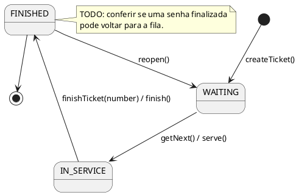

# Diagrama de estados da senha — inconsistente

```plantuml
@startuml
[*] --> WAITING : createTicket()
WAITING --> IN_SERVICE : getNext() / serve()
IN_SERVICE --> FINISHED : finishTicket(number) / finish()
FINISHED --> WAITING : reopen()
FINISHED --> [*]

note right of FINISHED
  TODO: conferir se uma senha finalizada
  pode voltar para a fila.
end note
@enduml
```

## Política de transição

TODO: definir o comportamento de operações incompatíveis com o estado atual.

